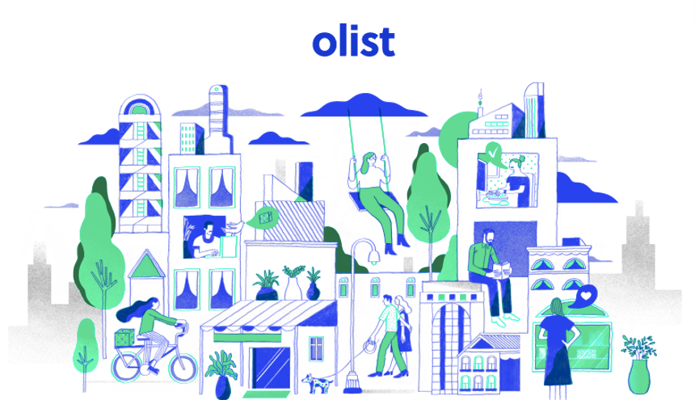
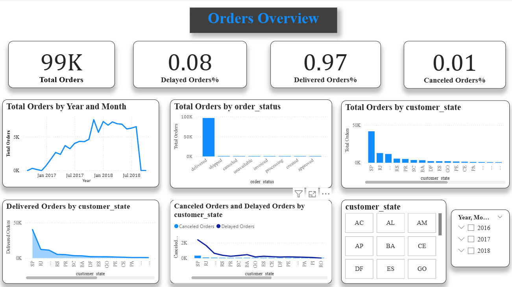
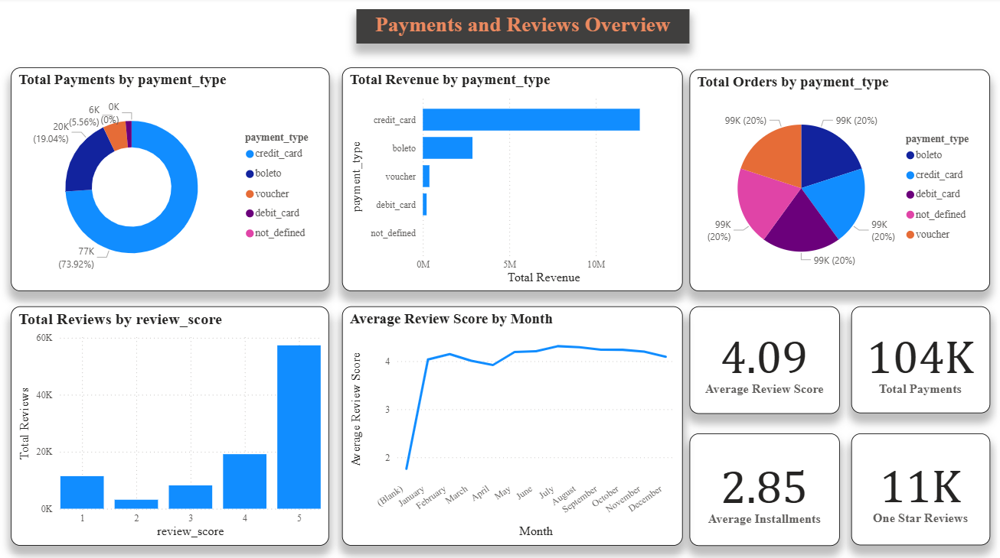

# **Brazilian E-Commerce (Olist) Analysis**

## **Table Of Contents**
- [Overview](#overview)
- [Data source](#data-source)
- [Analysis](#analysis)
- [Key Findings](#key-findings)
- [Project Files](#project-files)
- [Dashboard](#dashboard)

## **Overview**

This project combines SQL-based data analysis with Power BI dashboards to deliver business insights across orders, customers, payments, reviews, and geolocation.The SQL queries used in this project cover a wide range of analytical scenarios, showcasing the versatility of SQL in extracting meaningful insights from a relational database.

## **Data Source**
- [Brazilian E-Commerce Public Dataset by Olist](https://www.kaggle.com/datasets/olistbr/brazilian-ecommerce)

## **Project Overview**

This project focuses on data preparation, analysis, and exploration of the Olist dataset using SQL queries. Olist is a Brazilian e-commerce platform, and the analysis covers various aspects, including data cleaning, updating, and exploring business insights.

### **Data Preparation**

The data preparation section involves checking for duplicates and updating tables to ensure data accuracy. It includes handling empty spaces and null values in specific columns, translating product categories, and updating values to enhance data quality.

### **Data Analysis**

The data analysis section aims to answer several business questions. The analysis includes:

### **Customers Analysis**
1. How many unique customers are there in the dataset?
2. Count number of unique customers per state.
3. Calculate the average order value(money) per customer.
4. How many unique cities contribute to Olist’s customer base?
5. Which states use credit card payments the most, and how frequently are they used?
6. Which states have the highest customer base, and how much revenue do they generate?
7. Which states contribute the most revenue in each year?
8. Which customer placed the most orders?

### **Products Analysis**
1. Which product categories are the most popular (by order count)?
2. Which categories generate the highest total revenue? 
3. What is the average price and freight value per category?
4. How many unique product categories are there?
5. What are the Top 10 best-selling products?
6. Which product categories are most popular in each state?
7. Which products have the widest price range (max – min price)?

### **Orders Analysis**
1. Which states/cities experience the highest delays in deliveries?
2. Which delivery carriers (sellers) fulfill the most orders, and what’s their average review score?
3. Which months/years have the highest number of purchases?
4. Which order statuses are most common per state?
5. How many orders were placed each month?
6. How many orders were delayed per year, and is there a trend?
7. What is the order distribution across weekdays?

### **Order_items Analysis**
1. What are the unique order items in the dataset?
2. Which item/product is most popular and ordered most frequently?
3. Which product has the highest average review score? 
4. Which products are ordered most frequently in each state? 
5. What is the trend of items sold per month/year?

### **Payments Analysis**
1. What is the average number of installments per payment type?
2. Which payment type generates the highest revenue?
3. What is the distribution of payment types used?
4. Which payment method has the highest transaction value?
5. What is the average number of payment installments per order?

### **Reviews Analysis**
1. What is the average review score for each product category? 
2. Do late deliveries lead to lower ratings? 
3. What is the average review score across all orders?
4. How many 5-star & 1-star reviews are there?
5. Which product categories receive the highest average review scores?

### **Sellers Analysis**
1. Which sellers sold the most items?
2. How many unique products are sold by each seller?
3. List Top 5 sellers with the best average review score.
4. How many 1-star and 5-star reviews did each seller receive?
5. Which sellers have the widest geographic reach (number of unique states/cities served)?

## **Key Findings**
- The total revenue generated by Olist is $15,421,083.
- Olist had a total of 96,470 orders, with quarterly and monthly variations.
- Over 70% of all transactions were completed using credit cards, making it the most widely adopted payment method.
- States like São Paulo (SP), Rio de Janeiro (RJ), and Minas Gerais (MG) are responsible for the majority of sales and customers.
- Orders delivered later than the estimated delivery date were strongly correlated with lower review scores.
- Clear spikes in orders and revenue observed during year-end (November–December), likely due to Black Friday and holiday shopping.

## **Project Files**
olist.pbix: Power BI file containing the dashboard design and visualizations.
olist_customers_dataset.csv: Dataset containing information about Olist customers.
olist_geolocation_dataset.csv: Dataset containing geolocation information.
olist_order_items_dataset.csv: Dataset containing details about order items.
olist_order_payments_dataset.csv: Dataset containing information about order payments.
olist_order_reviews_dataset.csv: Dataset containing order reviews data.
olist_orders_dataset.csv: Dataset containing overall order details.
olist_products_dataset.csv: Dataset containing information about products.
olist_sellers_dataset.csv: Dataset containing details about Olist sellers.
product_category_name_translation.csv: Dataset containing translations for product category names.

## **Dashboard**
**Power BI File** - [Olist Analysis Dashboard](./dashboards/olist_analysis_dashboard.pbix)

### **Dashboard Overview**
This Power BI dashboard project provides a comprehensive sales analysis for an e-commerce platform in Brazil named Olist.The project utilizes data from various datasets related to Olist's customers, orders, payments, geolocation, products, sellers, and reviews.

1.Orders Overview
  

2. Payments and Review Overview
  

3.Sales and Revenue Overview
  

## **How To Use**
  Clone the repository to your local machine.
  git clone https://github.com/Sowmyapappu19/Brazilian-Ecommerce-Analysis.git

